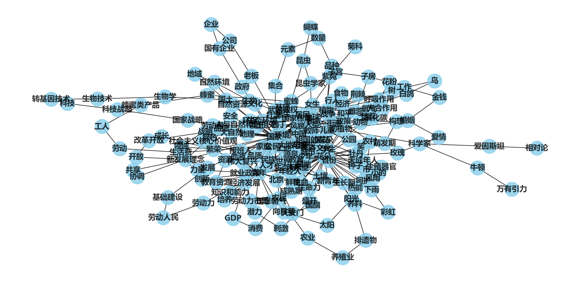
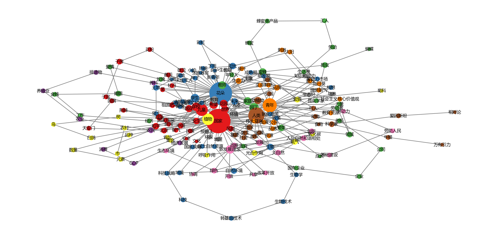
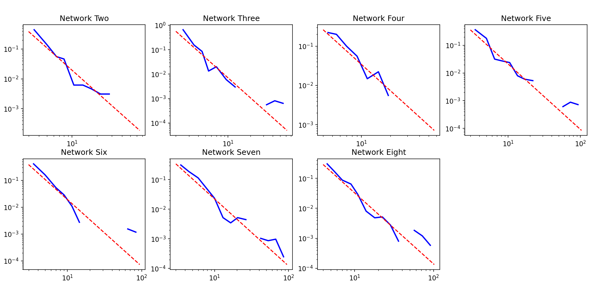
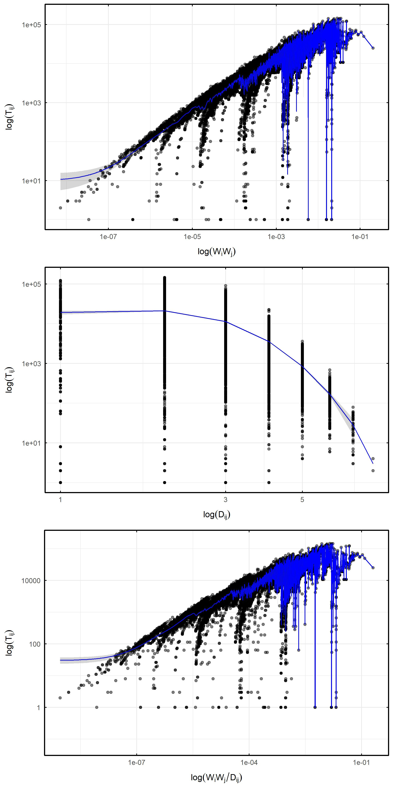
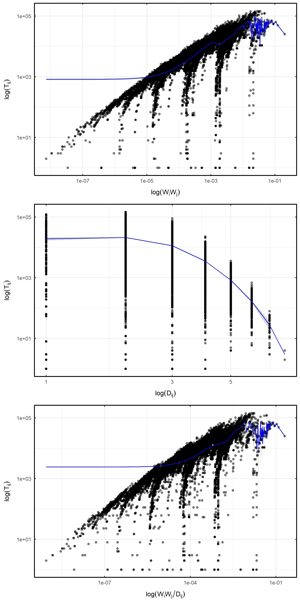

# Cognitive Networks Analysis| 认知网络分析

## Project Overview | 项目简介

**Cognitive Networks Analysis** aims to analyze and compute the complex network properties of human collective cognition networks, including small-world characteristics, scale-free properties, and community structures. This project also examines whether these networks adhere to the hypothesis of the social gravity law.

This project is developed using **Python** and **R**, with each language handling distinct data analysis tasks. It provides a complete workflow for code execution, data processing, and result generation.

**Cognitive Networks Analysis** 项目旨在分析和计算人类共同认知网络的复杂网络特性，包括小世界特性、无标度特性和社团特性。同时，本项目还验证了这些网络是否符合社会引力定律的假设。

本项目使用 **Python** 和 **R** 两种语言开发，分别处理不同的数据分析任务，提供完整的代码、数据和结果生成流程。


## Data Analysis Scope | 数据分析内容

* **Complex Network Analysis | 复杂网络分析**

  Includes the computation and validation of small-world, scale-free, and community structures. | 包括小世界特性、无标度特性和社团特性计算与验证。

* **Validation of Social Gravity Models | 社会引力模型验证**

  Examines whether human collective cognitive networks follow the social gravity models using non-parametric methods and quantitative models. | 基于非参数方法和定量模型，检验人类词汇认识网络是否遵循引力定律。


## File Structure | 文件结构

```plaintext
cognitive_networks_analysis/
├── cognitive_networks-python/   # Python-related files | Python 相关文件夹
│   ├── python_analysis/         # Core Python scripts | 核心 Python 脚本
│   │   ├── network_analysis.py  # Main network analysis script | 网络分析主脚本
│   │   ├── requirements.txt     # Python dependencies list | Python 依赖库清单
│   ├── python_data/             # Data for Python scripts | Python 数据文件夹
│   │   └── example_data.csv     # Example data file | 示例数据文件
│   ├── python_results/          # Python-generated results | Python 运行结果存放文件夹
│       ├── figures/             # Visualized charts | 可视化图表
│       └── tables/              # Analysis results tables | 分析结果表格
├── cognitive_networks-R/        # R-related files | R 相关文件夹
│   ├── R_analysis/              # Core R scripts | 核心 R 脚本
│   │   └── network_analysis.R   # Network analysis script | 网络特征分析脚本
│   ├── R_data/                  # Data for R scripts | R 数据文件夹
│   │   └── example_data.csv     # Example data file | 示例数据文件
│   ├── R_results/               # R-generated results | R 运行结果存放文件夹
│       ├── plots/               # Visualized charts | 可视化图表
│       └── tables/              # Analysis results tables | 分析结果表格
├── README.assets                # Folder for README images | README 图片文件夹
└── README.md                    # Project documentation | 项目说明文档
```


## Environment Setup | 环境配置

### Python

#### 1. Create Environment | 创建环境

​      Ensure Python 3.8 or later is installed | 确保已安装 Python 3.8 或更高版本。

#### 2. Install Dependencies | 安装依赖包

​      Run the following command to install all required packages automatically | 运行以下命令自动安装：

```bash
pip install -r cognitive_networks-python/python_analysis/requirements.txt
```

### R

#### 1. Install R (Version 4.0 or later) | 安装 R（版本 4.0 或更高）

#### 2. Install Required R Packages | 安装必要的 R 包

```R
install.packages(c("np", "ggplot2", "gridExtra"))
```


## Usage | 使用方法

#### 1. Download the project and navigate to the directory | 下载项目并进入目录

```bash
git clone https://github.com/yourusername/cognitive_networks.git
cd cognitive_networks-main
```

#### 2. Run Python scripts for network analysis | 运行 Python 运行 Python 脚本进行网络分析

For example, execute the script `network_analysis.py` | 例如运行`test01-calculate-node.py`脚本：

```bash
python cognitive_networks-python/python_analysis/test01-calculate-node.py
```

#### 3. Run R scripts to validate the social gravity law | 使用 R 脚本验证社会引力定律：
Navigate to the `R_analysis` folder, and run a script in the R environment | 进入 `R_analysis` 文件夹，在 R 环境中运行脚本，例如：

```bash
setwd("path/to/cognitive_networks-main/cognitive_networks-R/R_analysis")
source("test-aic.R")
```


## Script Descriptions and Results | 脚本描述及运行结果

### Python Scripts | Python 脚本

#### 1. test01-calculate-node.py

* **Description | 简要描述：**The script counts the nodes, edges, average degree, etc. of the network and visualizes the network. | 该脚本可以统计网络的节点、边、平均度等，并且对网络进行可视化。

* **Results | 运行结果:** 

<div><center><br>Network Two</center></div>

#### 2. test01-calculate-participants.py

* **Description | 简要描述：**Calculate the number of participants in the network. | 统计网络的参与者人数。

#### 3. test02-calculate-D-diameter.py

* **Description | 简要描述：**Calculate network diameter. | 统计网络直径`D`。

#### 4. test02-calculate-d-shortest_path_length.py

* **Description | 简要描述：**Calculate the shortest path length between two nodes in the network. | 统计网络中两个节点之间的最短路径长度$d$。

#### 5. test02-calculate-T-num_paths.py

* **Description | 简要描述：**Count all simple paths between two nodes in the network. | 统计网络中两个节点之间的所有简单路径。

#### 6. test02-calculate-w.py

* **Description | 简要描述：**Various metrics are calculated between two nodes in a network, including node frequency (word_count), degree, degree centrality, closeness centrality, betweenness, betweenness centrality, eigenvector centrality, clustering coefficient for a single node. | 统计网络中两个节点之间的各种指标，包括节点频率（word_count）、度（degree）、度中心性（degree centrality）、紧密度中心性（closeness centrality）、介数（betweenness）、介数中心性（betweenness centrality）、特征向量中心性（eigenvector centrality）、单个结点的聚类系数（clustering coefficient）。

#### 7. test03-draw-word_count-zipf.py

* **Description | 简要描述：**Verify that the network complies with Zipf's law. | 验证该网络是否符合齐普夫定律。

#### 8. test06.py

* **Description | 简要描述：**Data processing, consolidation, calculations, etc. | 数据处理、合并、计算等。

#### 9. test07-verify-community.py

* **Description | 简要描述：**Verify the modular structure. | 验证是否具备社团网络特性。
* **Results | 运行结果:** 

<div><center><br>Network Two</center></div>

#### 10. test07-verify-degree_distribution.py

* **Description | 简要描述：**Verify that it has scale-free network properties, conforms to a power law distribution, etc. | 验证是否具备无标度网络特性、是否符合幂律分布等。

* **Results | 运行结果:**

<div><center><br>Probability Density Functions of Seven Cognitive Networks</center></div>

#### 11. test07-verify-Six Degrees of Separation.py

* **Description | 简要描述：**Verify the availability of small-world network features. | 验证是否具备小世界网络特性。


### R Scripts | R 脚本

#### 1. test-aic.R

* **Description | 简要描述：**Local linear nonparametric methods for estimating conditional means using aic methods. | 局部线性非参数方法估计条件均值，使用aic方法

* **Results | 运行结果:**

<div><center><br>Network Two</center></div>

#### 2. test-ls.R

* **Description | 简要描述：**Local linear nonparametric methods for estimating conditional means using ls methods.| 局部线性非参数方法估计条件均值，使用ls方法

* **Results | 运行结果:**

<div><center><br>Network Two</center></div>

## Contribution Guidelines | 贡献指南

We welcome suggestions for improvements or bug reports! You can contribute by submitting [Issues](https://github.com/yourusername/cognitive_networks/issues) or [Pull Requests](https://github.com/yourusername/cognitive_networks/pulls). | 欢迎对本项目提出改进建议或报告问题！您可以通过提交 [Issues](https://github.com/Dinggz11/cognitive_networks/issues) 或 [Pull Requests](https://github.com/Dinggz11/cognitive_networks/pulls) 的方式参与贡献。


## Contact Information | 联系方式

For any questions or collaboration opportunities, please contact us: | 如果您有任何疑问或合作意向，请通过以下方式联系：

- Email: dinggz@gzhu.edu.cn
- GitHub: [Dinggz11]([Dinggz11](https://github.com/Dinggz11))
